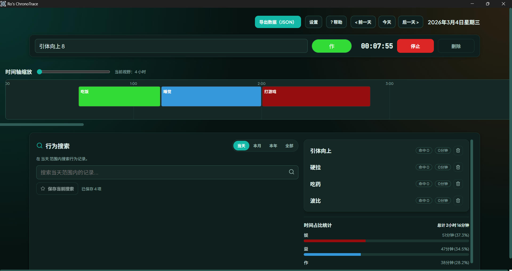

# Ro's ChronoTrace
[](https://tauri.app)
[](https://react.dev)
[](https://www.rust-lang.org)
[](./LICENSE)

一个基于 Tauri 的桌面时间跟踪应用，支持自动截图与窗口活动捕获，面向需要按时间线回溯工作内容的场景。

## 为什么做这个项目
- 用于解决我在使用 Toggl Track 过程中遇到的痛点（基于个人长期使用体验）：
    - 偶发重新登录
    - 统计查看依赖网页端
    - 长时间运行时资源占用体验不理想
    - 桌面端交互流畅度有提升空间

## 与 Toggl Track 对比（按本项目目标）
| 维度 | Ro's ChronoTrace | Toggl Track |
| --- | --- | --- |
| 核心定位 | 本地优先、时间线回溯、自动上下文捕获 | 通用 SaaS 时间跟踪与团队协作 |
| 自动截图与窗口活动 | 内置，开箱可用（Windows） | 非默认核心能力 |
| 历史回看方式 | 桌面端时间线直接回看 | 更多依赖 Web 报表/页面 |
| 数据存储 | 本地 SQLite + 本地截图文件 | 云端为主 |
| 适合人群 | 个人深度自我回顾与本地记录偏好 | 团队协作、跨平台 SaaS 流程 |
## Known Issues
- 截图文件目前会持续增长，尚未提供自动清理策略。
- 仅支持 Windows。
## 功能
- 时间轴创建与编辑时间条目
- 自动截图与窗口活动记录
- 按关键词搜索历史活动
- 导出 JSON 数据

## 界面截图


## 使用指南
### 创建时间条目
1. 在时间轴上点击并拖拽选择时间范围
2. 在弹出的对话框中输入标签
3. 选择颜色（可选）
4. 点击保存

### 浏览历史
- 使用“前一天”/“后一天”按钮导航
- 点击“今天”返回当前日期

### 搜索活动
1. 在搜索框中输入关键词（至少 2 个字符）
2. 查看搜索结果列表
3. 点击结果跳转到对应日期

### 导出数据
1. 点击 `Export Data (JSON)` 按钮
2. 数据将下载为 JSON 文件

## 数据存储位置（Windows）
- 数据库文件: `%LocalAppData%\RosChronoTrace\database.db`
- 截图存储: `%LocalAppData%\RosChronoTrace\screenshots\YYYY\MM\DD\`

## 快速开始
### 前置条件
- Node.js 20+
- Rust 1.75+
- Windows 10/11

### 安装与运行
```bash
git clone <repository-url>
cd toggl_like
npm install
npm run tauri:dev
```

### 生产构建
```bash
npm run tauri:build
```

构建输出目录: `src-tauri/target/release/bundle/`

## 开发
### 技术栈
- 前端: React 18, TypeScript 5.x, Vite, Zustand, TanStack Query
- 后端: Rust, Tauri 2.x, SQLite, Tokio, rusqlite
- Windows 捕获: windows-rs, windows-capture, rdev

### 常用命令
```bash
# React 测试
npm test

# Rust 测试
cd src-tauri && cargo test

# Rust 检查
cd src-tauri && cargo clippy
```

## 发布与自动更新
- 发布流程文档: `docs/release.md`
- 应用会在启动时检查 `latest.json` 进行自动更新


## 致谢
- [Tauri](https://tauri.app/)
- [React](https://react.dev/)
- [Rust](https://www.rust-lang.org/)
- [windows-rs](https://github.com/microsoft/windows-rs)
